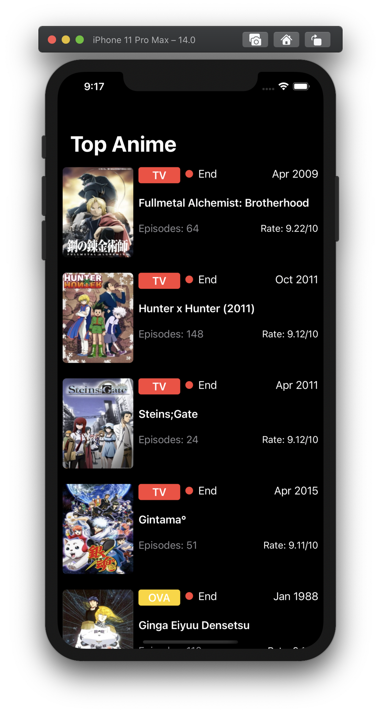

# MyAnimeList

    
    

## Frameworks

- SwiftUI
- Combine

## ScreenShots 

### Dark Mode

<table style="width:100%">
  <tr>
    <td></td>
    <td></td>
    <td></td>
    <td></td>
  </tr>
</table>

### Light Mode

<table style="width:100%">
  <tr>
    <td></td>
    <td></td>
    <td></td>
    <td></td>
  </tr>
</table>
